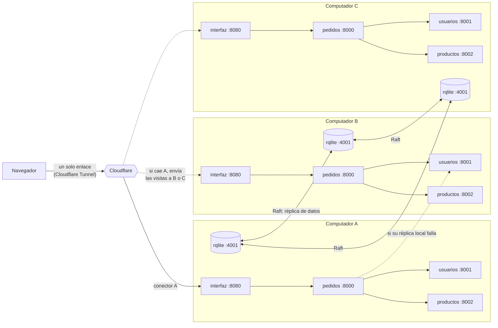

# Laboratorio: sistema de ventas distribuido con Docker

Tres servicios Flask independientes (usuarios, productos y pedidos), cada uno en su propio contenedor, comunicados mediante HTTP y JSON. Los datos se guardan en **rqlite**, una base de datos distribuida que copia la información en tres nodos. De cada servicio hay varias réplicas: si un contenedor o un computador se cae, el sistema sigue funcionando con los demás. Una interfaz web (puerto 8080) muestra el estado del clúster, los datos y permite ejecutar las pruebas.

## Trabajo en equipo con Git

Todos los integrantes trabajan sobre este mismo repositorio. Cada uno modifica solo la carpeta de su rol para no pisar el trabajo de otros.

| Integrante | Carpeta o archivos a su cargo |
|---|---|
| 1 | `usuarios/app.py`, `usuarios/requirements.txt` |
| 2 | `productos/app.py`, `productos/requirements.txt` |
| 3 | `pedidos/app.py`, `pedidos/requirements.txt` |
| 4 | Los `Dockerfile`, `docker-compose.yml`, `docker-compose.nodo.yml` y la carpeta `comun` |
| 5 | Revisión, pruebas y evidencias |

Clonar el repositorio (una sola vez):

```
git clone <URL-del-repositorio>
cd laboratorio-ventas
```

Antes de empezar a trabajar, traer los cambios de los demás:

```
git pull
```

Después de modificar sus archivos, subirlos:

```
git add .
git commit -m "Describe brevemente el cambio"
git push
```

Después de cada `git pull` que traiga cambios en el código, reconstruir los contenedores con `docker compose up -d --build`.

## Arquitectura

En el despliegue real, **todos los computadores son iguales**: cada uno corre un nodo de la base de datos y una réplica de cada servicio. Cada servicio usa primero la réplica de su propio computador y, si no responde, la de otro. El diagrama muestra tres; con cinco (D: máquina virtual con Kali Linux, E: Mac) es igual, y los cinco votan en la base (paso 10).


```mermaid
flowchart LR
    N["Navegador"] -- "un solo enlace<br/>(Cloudflare Tunnel)" --> CF{{"Cloudflare"}}
    CF -- "conector A" --> IA
    CF -. "si cae A, envía<br/>las visitas a B o C" .-> IB
    CF -.-> IC
    subgraph A["Computador A"]
        IA["interfaz :8080"] --> PA["pedidos :8000"]
        PA --> UA["usuarios :8001"]
        PA --> RA["productos :8002"]
        DA[("rqlite :4001")]
    end
    subgraph B["Computador B"]
        IB["interfaz :8080"] --> PB["pedidos :8000"]
        PB --> UB["usuarios :8001"]
        PB --> RB["productos :8002"]
        DB[("rqlite :4001")]
    end
    subgraph C["Computador C"]
        IC["interfaz :8080"] --> PC["pedidos :8000"]
        PC --> UC["usuarios :8001"]
        PC --> RC["productos :8002"]
        DC[("rqlite :4001")]
    end
    DA <-- "Raft: réplica de datos" --> DB
    DB <-- "Raft" --> DC
    DA <-- "Raft" --> DC
    PA -. "si su réplica local falla" .-> UB
```

| Servicio  | Puerto | Endpoints |
|-----------|--------|-----------|
| usuarios  | 8001   | `GET /salud`, `GET /usuarios`, `GET /usuarios/<id>`, `POST /usuarios`, `PUT /usuarios/<id>`, `DELETE /usuarios/<id>` |
| productos | 8002   | `GET /salud`, `GET /productos`, `GET /productos/<id>`, `POST /productos`, `PUT /productos/<id>`, `DELETE /productos/<id>`, `POST /productos/<id>/descontar`, `POST /operaciones/<id>/revertir` |
| pedidos   | 8000   | `GET /salud`, `GET /pedidos`, `POST /pedidos` |
| interfaz  | 8080   | `GET /` (página web), `GET /api/cluster` (estado de todas las réplicas), `/api/<servicio>/<ruta>` (reenvío a la primera réplica que responda) |
| rqlite    | 4001 y 4002 | 4001: consultas de los servicios · 4002: replicación entre nodos |

Datos iniciales (se cargan una sola vez, la primera vez que arranca la base):

- Usuarios: U01 Ana (activo), U02 Carlos (activo), U03 Luisa (inactivo).
- Productos: P01 Audífonos ($50.000, 10 unidades), P02 Teclado ($120.000, 5), P03 Mouse ($35.000, 0).

Códigos de respuesta de `POST /pedidos`: 201 pedido creado, 400 datos inválidos, 404 usuario o producto inexistente, 409 usuario inactivo o existencias insuficientes, 503 ninguna réplica de un servicio responde o la base de datos no tiene mayoría.

## Persistencia, semáforos y tolerancia a fallos

### Base de datos distribuida (rqlite)

- **Los datos no se pierden.** rqlite guarda la base SQLite en disco, en un volumen de Docker. Apagar o reiniciar los contenedores no borra nada. Solo `docker compose down -v` borra los datos, porque elimina los volúmenes.
- **Hay una copia sincronizada en cada computador.** Cada escritura la recibe el nodo **líder**, que la envía a los demás con el algoritmo de consenso **Raft**. Se confirma cuando la mayoría la guardó (2 de 3 con tres computadores, 3 de 5 con cinco), así que todos los nodos tienen la misma información.
- **Si caen nodos, la base sigue mientras haya mayoría.** Si se cae el líder, los demás eligen uno nuevo en pocos segundos. Con tres computadores se aguanta perder 1; con cinco, perder 2. Sin mayoría (1 de 3, o 2 de 5) la base deja de aceptar cambios para no quedar inconsistente, y el sistema responde 503 hasta que vuelva otro nodo.
- **Nunca cuatro votantes.** Con cuatro se necesitan 3 vivos: se aguanta perder solo 1, igual que con tres, pero con más piezas que pueden fallar.
- **Las lecturas son linealizables** (`level=linearizable`): las atiende el líder después de confirmar con la mayoría que sigue siéndolo, así que nunca devuelven un dato viejo. A diferencia de `level=strong`, no se escriben en el registro de Raft, lo que reduce a la mitad el tráfico entre computadores en las ráfagas de compras.
- **Si se está eligiendo un líder**, cada consulta reintenta hasta 15 s antes de responder que la base no está disponible. Por internet, una elección puede tardar varios segundos.
- **Cada servicio maneja su propia tabla**: `usuarios`, `productos`, `operaciones` y `pedidos`. Los servicios no guardan nada en memoria; por eso cualquier réplica puede atender cualquier petición.

### Semáforos

- **Semáforo binario distribuido (inventario).** El líder de la base aplica las escrituras de una en una, y en el mismo orden en todos los nodos. Descontar es una sola transacción:

  ```sql
  UPDATE productos SET existencias = existencias - ? WHERE numero = ? AND existencias >= ?;
  INSERT INTO operaciones (operacion, producto, cantidad) SELECT ?, ?, ? WHERE changes() = 1;
  ```

  Ninguna otra compra puede meterse entre "verificar" y "descontar", aunque llegue a otra réplica de productos en otro computador. Esto reemplaza al `threading.Lock` anterior, que solo protegía dentro de un proceso.
- **Semáforo contador (pedidos).** Cada réplica de pedidos procesa como máximo 8 compras a la vez (`threading.BoundedSemaphore`, variable `PEDIDOS_SIMULTANEOS`). Las demás esperan su turno hasta 10 s, para no saturar a los otros servicios ni a la base.
- **IDs sin choques.** La base asigna los números (`AUTOINCREMENT`). Dos réplicas que crean un usuario o un pedido al mismo tiempo nunca obtienen el mismo ID, y un ID borrado no se reutiliza.

### Réplicas y cambio automático

- **Lista de réplicas.** Cada servicio conoce todas las réplicas de los demás (`USUARIOS_URLS`, `PRODUCTOS_URLS`, `PEDIDOS_URLS`, `DB_URLS`): primero la de su computador y luego las de los otros. Si una no responde en 1.5 s, prueba la siguiente.
- **Memoria de réplicas caídas.** La réplica que falló pasa al final de la lista durante 15 s. Así, solo la primera petición después de una caída paga la espera.
- **Sin descuentos dobles.** Cada descuento lleva un identificador de operación único. Si pedidos reintenta en otra réplica de productos, la operación no se descuenta dos veces. Si no se sabe si se aplicó, pedidos la revierte (`POST /operaciones/<id>/revertir`), y revertir dos veces tampoco suma unidades de más.
- **Escrituras sin confirmar.** Una escritura solo se repite en otro nodo o réplica si la petición no alcanzó a llegar (no hubo conexión). Si llegó pero la respuesta no volvió a tiempo, por ejemplo durante un cambio de líder, pudo haberse aplicado: no se repite, para no guardar dos veces el mismo registro ni crear dos pedidos por una compra. En ese caso la respuesta dice "No se pudo confirmar si el cambio se guardó" y hay que revisar los datos antes de repetir. Al modificar, si el cambio se guardó y solo falla leerlo de vuelta, la respuesta es correcta igual.
- **Un solo enlace público (Cloudflare Tunnel).** Todos los computadores corren el mismo túnel. Cloudflare envía cada visita a un conector vivo: si cae un computador, el enlace sigue funcionando con los demás, sin que nadie cambie de dirección (paso 11). El conector corre dentro del contenedor de la interfaz, así que si solo cae la interfaz de un equipo, ese conector también se desconecta.
- **Alternativa con un enlace por computador (Tailscale Funnel).** La página conoce las tres entradas (`ENTRADAS`): si la suya deja de responder, sigue sola por otra y lo indica arriba a la derecha. Solo sirve para una página que ya estaba abierta.

## Estructura de archivos

```
laboratorio-ventas/
├── docker-compose.yml        # todo en un computador, simulando el clúster
├── docker-compose.nodo.yml   # un nodo del despliegue real (igual en todos los computadores)
├── .env.ejemplo              # plantilla del .env de cada computador
├── comun/
│   ├── bd.py                 # cliente de rqlite con cambio automático de nodo
│   └── replicas.py           # memoria de réplicas caídas
├── usuarios/   (app.py, Dockerfile, requirements.txt)
├── productos/  (app.py, Dockerfile, requirements.txt)
├── pedidos/    (app.py, Dockerfile, requirements.txt)
└── interfaz/   (app.py, Dockerfile, requirements.txt, static/index.html)
```

Las imágenes se construyen desde la raíz del repositorio, para que cada una copie solo su `app.py` y los módulos de `comun` que necesita.

## Requisitos

- Docker Desktop instalado y **abierto** (el ícono de la ballena debe indicar que está en ejecución).
- Windows 10/11 con PowerShell, o macOS (Intel o Apple Silicon) con Terminal.
- Puertos 4001, 8000, 8001, 8002, 8080 y 8081 libres. En el despliegue en varios computadores también el 4002.

Comprobar Docker:

```powershell
docker --version
docker compose version
```

Resultado esperado: ambos comandos muestran una versión. Si aparece un error de conexión con el "Docker daemon", Docker Desktop no está abierto.

---

## Paso 1. Entrar a la carpeta del proyecto

```powershell
cd ruta\a\laboratorio-ventas
dir
```

Resultado esperado: se ven `docker-compose.yml`, `docker-compose.nodo.yml`, `README.md` y las carpetas `comun`, `usuarios`, `productos`, `pedidos` e `interfaz`.

## Paso 2. Levantar el clúster simulado en un computador

```powershell
docker compose up -d --build
```

Se levantan 11 contenedores: 3 nodos de la base (`bd-1`, `bd-2`, `bd-3`), 2 réplicas de cada servicio (`servicio-usuarios-1`, `servicio-usuarios-2`…) y 2 entradas web (`servicio-interfaz-1` en el puerto 8080 y `servicio-interfaz-2` en el 8081). La primera vez tarda unos minutos, porque descarga las imágenes `python:3.12-slim` y `rqlite/rqlite`.

## Paso 3. Comprobar que todo está en ejecución

```powershell
docker compose ps
```

Resultado esperado: los 11 contenedores con estado `Up`.

Consultar la base de datos, que muestra cuál nodo es el líder:

```powershell
Invoke-RestMethod "http://localhost:4001/nodes?ver=2" | Select-Object -ExpandProperty nodes | Format-Table id, leader, reachable
```

Consultar la salud y los datos (se publica la réplica 1 de cada servicio):

```powershell
Invoke-RestMethod http://localhost:8001/salud
Invoke-RestMethod http://localhost:8001/usuarios
Invoke-RestMethod http://localhost:8002/productos
```

## Interfaz web

Abrir en el navegador **http://localhost:8080** (o la entrada 2, **http://localhost:8081**). La página muestra:

1. **Estado del clúster**: cada 3 segundos, las réplicas de usuarios, productos y pedidos, y los nodos de la base con su papel (líder o seguidor). Verde es todo en orden; ámbar, algo cayó pero el servicio sigue en pie; rojo, caído.
2. **Crear un pedido**: envía `POST /pedidos` y muestra el código HTTP, el JSON de respuesta y el recorrido de la solicitud.
3. **Pruebas del laboratorio**: los casos de los pasos 4 a 6 y una **prueba de concurrencia**, que envía muchos pedidos a la vez y comprueba que `existencias antes − aceptados × cantidad = existencias después`.
4. **Gestión de usuarios y productos**: crear (`POST`), consultar (`GET`), modificar (`PUT`) y eliminar (`DELETE`).
5. **Pedidos registrados**, con la réplica de pedidos que atendió cada compra.
6. **Registro de solicitudes**: cada petición, con la dirección exacta de la réplica que la atendió.

## Preparación de las pruebas de compra (PowerShell)

`Invoke-RestMethod` lanza una excepción cuando la respuesta es un error (4xx o 5xx) y oculta el cuerpo JSON. Para ver siempre el código HTTP y el JSON, pegar esta función una vez en la ventana de PowerShell (funciona en Windows PowerShell 5.1 y en PowerShell 7):

```powershell
function Enviar-Pedido($usuario, $producto, $cantidad) {
    $cuerpo = @{ usuario_id = $usuario; producto_id = $producto; cantidad = $cantidad } | ConvertTo-Json
    try {
        $r = Invoke-WebRequest -Uri "http://localhost:8000/pedidos" -Method Post `
             -ContentType "application/json" -Body $cuerpo -UseBasicParsing
        "HTTP $($r.StatusCode)"
        $r.Content | ConvertFrom-Json | ConvertTo-Json -Depth 5
    } catch {
        "HTTP $([int]$_.Exception.Response.StatusCode)"
        $_.ErrorDetails.Message | ConvertFrom-Json | ConvertTo-Json -Depth 5
    }
}
```

Si se cierra la ventana de PowerShell, hay que volver a pegar la función.

## Paso 4. Compra válida

```powershell
Enviar-Pedido U01 P01 2
```

Resultado esperado: `HTTP 201` y el pedido con `"id": "PED-0001"` (el número aumenta con cada pedido), el total de 100000, las existencias restantes y `atendido_por` (la réplica de pedidos que lo procesó). Para ver los pedidos guardados:

```powershell
(Invoke-WebRequest http://localhost:8000/pedidos -UseBasicParsing).Content
```

## Paso 5. Usuario inexistente

```powershell
Enviar-Pedido U99 P01 1
```

Resultado esperado: `HTTP 404` y `{ "error": "El usuario U99 no existe" }`.

## Paso 6. Cantidad superior a las existencias

```powershell
Enviar-Pedido U01 P01 50
```

Resultado esperado: `HTTP 409` y `Existencias insuficientes de Audífonos: se solicitaron 50 y solo hay 8`.

Pruebas adicionales de validación:

| Comando                   | Código | Mensaje esperado                                        |
|---------------------------|--------|---------------------------------------------------------|
| `Enviar-Pedido U01 P01 0` | 400    | La cantidad debe ser un número entero mayor que cero    |
| `Enviar-Pedido U03 P01 1` | 409    | El usuario U03 no está activo                           |
| `Enviar-Pedido U01 P99 1` | 404    | El producto P99 no existe                               |
| `Enviar-Pedido U01 P03 1` | 409    | Existencias insuficientes de Mouse: se solicitaron 1 y solo hay 0 |

## Paso 7. Consultar los registros de ejecución

```powershell
docker compose logs -f pedidos-1
```

Resultado esperado después de la compra válida:

```
[pedidos] Solicitud recibida: {'usuario_id': 'U01', 'producto_id': 'P01', 'cantidad': 2}
[pedidos] -> GET http://usuarios-1:8001/usuarios/U01
[pedidos] <- 200 desde usuarios en http://usuarios-1:8001
[pedidos] -> POST http://productos-1:8002/productos/P01/descontar
[pedidos] <- 200 desde productos en http://productos-1:8002
[pedidos] Pedido PED-0001 creado. Total: 100000. Quedan 8 de P01
```

Las líneas `WARNING: This is a development server` son normales en un laboratorio.

## Paso 8. Persistencia: apagar todo y volver a encender

```powershell
docker compose down
docker compose up -d
(Invoke-WebRequest http://localhost:8000/pedidos -UseBasicParsing).Content
```

Resultado esperado: los pedidos, usuarios y productos siguen ahí. `down` elimina los contenedores, pero no los volúmenes con los datos. Para empezar de cero, con los datos iniciales, usar `docker compose down -v`.

## Paso 9. Tolerancia a fallos

Con la interfaz abierta en http://localhost:8080 se ve cada caída en tiempo real.

### 9.1 Se cae una réplica de cada servicio

```powershell
docker compose stop usuarios-1 productos-1 pedidos-1
```

Hacer una compra desde la interfaz (puerto 8080). Resultado esperado: `201`, atendida por `pedidos-2`. Las tarjetas quedan en ámbar ("1/2 réplicas · sigue en pie"). La primera compra tarda unos segundos mientras descubre las caídas; las siguientes son inmediatas.

```powershell
docker compose start usuarios-1 productos-1 pedidos-1
```

### 9.2 Se cae el nodo líder de la base

Ver cuál es el líder en la tarjeta "Base de datos" y detenerlo, por ejemplo:

```powershell
docker compose stop rqlite-1
```

Resultado esperado: en pocos segundos otro nodo pasa a ser líder y las compras siguen funcionando.

### 9.3 Se pierde la mayoría

```powershell
docker compose stop rqlite-2
```

Con solo 1 de 3 nodos, la base deja de aceptar cambios. Una compra responde `503` con "La base de datos no está disponible". Al volver a encender un nodo, el sistema se recupera solo:

```powershell
docker compose start rqlite-1 rqlite-2
```

### 9.4 Se cae una entrada web

Con la página abierta en http://localhost:8080:

```powershell
docker compose stop interfaz-1
```

Resultado esperado: la página sigue funcionando y arriba a la derecha muestra "entrada: localhost:8081 · cambió automáticamente".

```powershell
docker compose start interfaz-1
```

### 9.5 Red, DNS y kernel compartido

```powershell
docker network inspect red_ventas --format "{{range .Containers}}{{.Name}} {{.IPv4Address}}{{println}}{{end}}"
docker compose exec pedidos-1 python -c "import requests; print(requests.get('http://usuarios-2:8001/salud').text)"
docker compose exec pedidos-1 python -c "import requests; print(requests.get('http://localhost:8001/salud').text)"
docker compose exec usuarios-1 uname -r
docker compose exec productos-1 uname -r
```

Resultado esperado: cada contenedor tiene su propia IP. Pedidos llega a `usuarios-2` por su nombre de servicio. La llamada a `localhost` falla con `Connection refused`, porque dentro del contenedor `localhost` es el propio contenedor. Los dos `uname -r` muestran el mismo kernel, el de la máquina virtual ligera de Docker Desktop.

## Paso 10. Despliegue real en cinco computadores

Todos los computadores usan **el mismo archivo**, `docker-compose.nodo.yml`. Cada uno corre un nodo de la base y una réplica de cada servicio. Solo cambia el `.env`.

| Nodo | Equipo |
|------|--------|
| A, B, C | Computadores con Docker Desktop (Windows o Mac) |
| D | Máquina virtual con Kali Linux y Docker Engine |
| E | Mac con Docker Desktop |

Los cinco **votan** en la base: se necesitan 3 de 5 encendidos y se aguanta que se apaguen 2. Por eso los cinco deben estar encendidos durante las pruebas y la exposición. Si solo se usan A, B y C, todo funciona igual, con la regla de 2 de 3.

1. **Una sola red de Tailscale.** Cada computador habla directo con cada uno de los otros (Raft y el relevo de servicios), así que todos deben verse entre sí. Si usan cuentas distintas, cada equipo nuevo se comparte con todos los demás y al revés; es más simple tener los cinco equipos en una misma red. Cada uno anota su IP con `tailscale ip -4`.
2. **Docker y firewall en cada equipo.** Los puertos son 4001, 4002, 8000, 8001, 8002 y 8080.
   - **Windows (A, B, C):** Docker Desktop abierto. Abrir los puertos en PowerShell como administrador:

     ```powershell
     New-NetFirewallRule -DisplayName "Laboratorio ventas" -Direction Inbound -Protocol TCP -LocalPort 4001,4002,8000,8001,8002,8080 -Action Allow -Profile Any
     ```

   - **Kali Linux en máquina virtual (D):**
     - La VM debe correr en un computador que **no** sea otro nodo: si su anfitrión se apaga, caen dos nodos a la vez.
     - Darle unos 4 GB de RAM, 2 CPU y 20 GB de disco, y desactivar la suspensión de la VM y del anfitrión. Docker no necesita virtualización anidada: los contenedores no son máquinas virtuales.
     - Instalar Docker, Git y Tailscale dentro de la VM:

       ```bash
       sudo apt update && sudo apt install -y docker.io docker-compose git curl
       sudo systemctl enable --now docker
       sudo usermod -aG docker $USER      # luego cerrar sesión y volver a entrar
       curl -fsSL https://tailscale.com/install.sh | sh
       sudo tailscale up
       ```

     - Si `docker compose version` no responde, usar `docker-compose` (con guion) en los comandos de esta guía.
     - Kali no trae el firewall activo. Si usan `ufw`, abrir los mismos puertos: `sudo ufw allow 4001:4002/tcp` y `sudo ufw allow 8000:8002/tcp` y `sudo ufw allow 8080/tcp`.
   - **Mac (E):**
     - Docker Desktop para Mac abierto. Sirve en Apple Silicon y en Intel: todas las imágenes del proyecto tienen las dos versiones.
     - Tailscale con la app de macOS. Si macOS pregunta por conexiones entrantes, aceptarlas.
     - Evitar que se duerma mientras sea nodo: dejar abierta una terminal con `caffeinate -dims`, o ajustar la energía. Un MacBook con la tapa cerrada se suspende y su nodo desaparece.
3. **Archivo `.env`** en cada computador. En Windows:

   ```powershell
   Copy-Item .env.ejemplo .env
   notepad .env
   ```

   En Kali o Mac: `cp .env.ejemplo .env` y `nano .env`.

   Poner `NODO` (A, B, C, D o E), `MI_IP` (la IP de ese equipo) y `NODOS`, con las IP de **todos** los computadores separadas por coma: es la misma línea en los cinco. Además `ENTRADAS` y `TUNNEL_TOKEN` (paso 11). `.env` está en `.gitignore`, porque cambia en cada equipo. Un `.env` de antes, con `IP_OTRO_1` e `IP_OTRO_2` y sin `NODOS`, sigue funcionando como tres computadores.

4. **Levantar el nodo** en cada computador:

   ```powershell
   docker compose -f docker-compose.nodo.yml up -d --build
   ```

   - **Si A, B y C ya estaban corriendo:** primero poner en sus `.env` la línea `NODOS` con las cinco IP y repetir el comando en los tres, para que sus servicios conozcan a D y E. Después levantar D y E: se unen solos al clúster como votantes y reciben una copia completa de los datos.
   - **Si el clúster se crea desde cero** (por ejemplo, después de `down -v` en todos): la base espera a tres nodos para elegir el primer líder. Levantar primero A, B y C, y después D y E.
   - **Comprobar:** la tarjeta "Vida de los nodos" debe decir "5 de 5 nodos vivos". También se puede ver con `curl http://localhost:4001/nodes?pretty`.

5. **Publicar la interfaz** con un solo enlace para todo el sistema: ver el paso 11 (Cloudflare Tunnel). Alternativa sin dominio, con un enlace por computador:

   ```powershell
   tailscale funnel --bg 8080
   ```

   En ese caso, copiar todos los enlaces `https://…ts.net` en `ENTRADAS` del `.env` de cada equipo y aplicar el cambio con `docker compose -f docker-compose.nodo.yml up -d`.

6. **Retirar un computador para siempre.** Un votante que ya no existe sigue contando para la mayoría, así que hay que sacarlo del clúster desde cualquier nodo vivo (en el ejemplo, el nodo E):

   ```powershell
   Invoke-RestMethod -Method Delete -Uri http://localhost:4001/remove -Body '{"id":"nodo-E"}'
   ```

   En Kali o Mac: `curl -XDELETE http://localhost:4001/remove -d '{"id":"nodo-E"}'`. Luego quitar su IP de `NODOS` en los demás `.env` y repetir el paso 4.

**Prueba de la tolerancia a fallos:** con los cinco encendidos, abrir el enlace y apagar dos computadores completos (por ejemplo D y E, o B y C). La base sigue con 3 de 5, el enlace responde desde otro computador y las compras siguen. Si se apaga un tercero, no hay mayoría y el sistema responde 503 hasta que vuelva uno. Al encender los apagados, cada nodo se pone al día solo con lo que se escribió mientras estaba apagado.

## Paso 11. Un solo enlace con Cloudflare Tunnel

**Enlace del sistema: https://ventas.sistemasdistribuidos.me**

Un túnel de Cloudflare puede tener varios **conectores**, hasta 25. Todos los computadores corren el mismo túnel (`ventas`) con el mismo token, y Cloudflare envía cada visita a un conector vivo. Así hay **una sola dirección** para todo el sistema, y sigue funcionando aunque se caiga cualquiera de ellos. Funciona también para alguien que abre el enlace por primera vez después de la caída.

El conector va **dentro del contenedor de la interfaz** (`interfaz/iniciar.sh`). Nunca queda un conector conectado sin una interfaz que responda detrás:

- Si se cae la interfaz o el conector, se detiene el otro y Docker vuelve a encender el contenedor.
- Al apagar el contenedor, primero se desconecta el conector y después se detiene la interfaz.

El túnel, la dirección `ventas.sistemasdistribuidos.me` y el token ya están creados. En **cada computador** solo hay que:

1. Agregar al `.env` el token, que es el mismo en todos y se pide por un chat privado, porque quien lo tiene puede conectar equipos al túnel. Cambiar también `ENTRADAS`:

   ```ini
   ENTRADAS=https://ventas.sistemasdistribuidos.me
   TUNNEL_TOKEN=eyJ...
   ```

2. Aplicar el cambio:

   ```powershell
   git pull
   docker compose -f docker-compose.nodo.yml up -d --build
   docker logs servicio-interfaz
   ```

   En el registro debe aparecer `Registered tunnel connection` cuatro veces.

3. Si estaba activo, apagar el enlace de Tailscale, que ya no se usa: `tailscale funnel --bg off`. Tailscale sigue siendo necesario para que los computadores se comuniquen entre sí.

Para ver los conectores del túnel, en el computador que tiene el certificado de Cloudflare:

```powershell
docker run --rm -v ${HOME}/.cloudflared:/home/nonroot/.cloudflared cloudflare/cloudflared:2026.9.1 tunnel info ventas
```

**Prueba:** abrir el enlace. En el diagrama, el nodo "Interfaz" muestra qué computador atiende. Apagar ese computador con `docker compose -f docker-compose.nodo.yml stop` o cerrando Docker. La misma dirección sigue respondiendo desde otro computador. Si se apaga de golpe, Cloudflare tarda unos 7 s en notarlo; la página reintenta sola durante ese tiempo.

**Cómo se creó el túnel**, por si hay que repetirlo con otro dominio. El dominio debe estar agregado a Cloudflare; los comandos se ejecutan una sola vez, en un computador:

```powershell
$CF = "docker run --rm -v ${HOME}/.cloudflared:/home/nonroot/.cloudflared cloudflare/cloudflared:2026.9.1"
Invoke-Expression "$CF tunnel login"          # abre un enlace: elegir el dominio y Authorize
Invoke-Expression "$CF tunnel create ventas"
Invoke-Expression "$CF tunnel route dns ventas ventas.sistemasdistribuidos.me"
Invoke-Expression "$CF tunnel token ventas"   # el token que va en TUNNEL_TOKEN
```

---

## Equivalentes en macOS (Terminal)

Los comandos `docker` y `docker compose` son idénticos. Solo cambian las peticiones HTTP, que se hacen con `curl`:

```bash
curl http://localhost:8001/salud
curl http://localhost:8002/productos
curl -s -X POST http://localhost:8000/pedidos \
  -H "Content-Type: application/json" \
  -d '{"usuario_id":"U01","producto_id":"P01","cantidad":2}' \
  -w "\nHTTP %{http_code}\n"
curl "http://localhost:4001/nodes?ver=2"
```

En la salida de `curl`, las tildes aparecen como `í`, `á`, etc. Es la forma estándar de JSON de representar esos caracteres.

## Pruebas con Postman

- Método `POST`, URL `http://localhost:8000/pedidos`.
- Pestaña Body → raw → JSON:

```json
{ "usuario_id": "U01", "producto_id": "P01", "cantidad": 2 }
```

## Solución de problemas

| Síntoma | Causa probable | Solución |
|---|---|---|
| `error during connect` o `Cannot connect to the Docker daemon` | Docker Desktop cerrado | Abrir Docker Desktop y esperar a que inicie |
| `port is already allocated` | Otro programa o un sistema anterior usa 4001, 8000-8002, 8080 u 8081 | `docker ps` para ver quién lo usa y detenerlo, o cambiar el puerto izquierdo en `ports` |
| Los servicios repiten "Esperando a la base de datos" | La base todavía no tiene líder; la primera vez necesita tres nodos | Esperar o revisar `docker compose logs rqlite-1`; en el despliegue real, que haya mayoría encendida (3 de 5) y que todos se vean por Tailscale |
| "Vida de los nodos" no muestra a D o E | El nodo nuevo no alcanza a los demás, o los demás no tienen su IP en `NODOS` | Revisar que se vea por Tailscale con los cinco, el firewall y la línea `NODOS` en todos los `.env`; luego repetir el paso 4 |
| En Kali, `docker compose` no existe | El paquete instala Compose como `docker-compose` | Usar `docker-compose` (con guion) en los comandos |
| Todas las compras responden 503 "La base de datos no está disponible" | Quedan menos de 2 nodos de la base | Encender otro nodo; el sistema se recupera solo |
| Un cambio responde "No se pudo confirmar si el cambio se guardó" | La base tardó en responder, por ejemplo mientras elegía líder | Recargar los datos y revisar si el cambio quedó antes de repetirlo |
| Se quieren borrar todos los datos y empezar de cero | Los datos persisten en volúmenes | `docker compose down -v` y luego `docker compose up -d` |
| Los cambios en `app.py` no se reflejan | La imagen no se reconstruyó | `docker compose up -d --build` |
| El enlace de Cloudflare muestra un error (502, 530 o 1033) | Ningún computador tiene el conector activo | `docker logs servicio-interfaz` en cada equipo: debe decir `Registered tunnel connection`. Revisar que `TUNNEL_TOKEN` esté en el `.env` y volver a ejecutar `docker compose -f docker-compose.nodo.yml up -d` |
